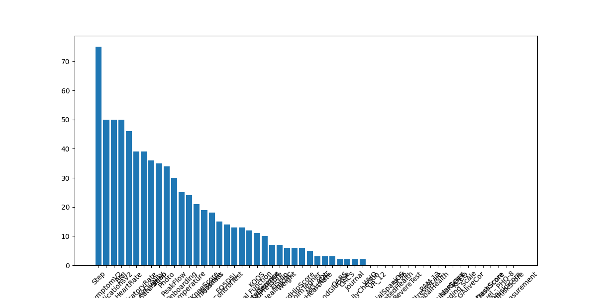

# Reoprt of AI-Deployment Project
### (Repository: https://github.com/mortezaf-huma/AI-deployment)

Any deployment in Huma products has three main components: Modules, Learn, and KeyActions (To-do). My strategy for executing this project adheres to the following algorithm:

1- In the first step I extract deployment data from ppserver and demo-asthma. After data cleaning, I identify approximately 140 deployments. Since these data contain numerous deployments designed for testing purposes, I switched to new data from pp-demo and gcp-demo-asthma and find out 83 examples.

2- Using the database from step 1 and information from https://huma-docs-preview.web.app, I compile a list of modules along with their descriptions. This list consists of 56 modules, playing a crucial role in the algorithm. Any potential extensions to these modules, including those already in use, should be incorporated into this dataset. Additionally, for each module, I develop a config based on our data from Step 1. However, special attention should be given to the module "Symptoms", as it is closely related to the context of deployment and can be present in several structure. 

3- I prompt GPT to refine the query, simplifying it for the similarity search. Throughout the algorithm, I use this revised version as the input query. This step helps in accepting queries in other languages or even with typos, although the result will be English. Throughout the algorithm, I utilize this revised version as the input query. This step facilitates the acceptance of queries in other languages or with potential typos, ensuring that the output remains in English.

4- I employ an embedding method to identify 15 most relevant modules for the query.

5- Next, I submit these 15 modules to GPT along with a prompt requesting it to identify all relevant items. In this step, the prompt engineering is very important. Various alternative approaches exist, including: 
- Sending only the names of these 15 modules to GPT,
- Examining the names along with their descriptions,
- Sending all 56 modules, with or without descriptions,
- Utilizing a two-step request: first, asking GPT to generate a preliminary list, and in the second round, revising the list by providing more information about the modules.

After experimentation, it has been determined that the optimal solution involves sending the names of the 15 modules along with the related prompt. **It is worth noting that the result of the search similarity via the embedding method can be considered in the future instead of relying on asking GPT**

6- After selecting the modules for our deployment, we use API request to https://rpmdevgcpukapi.staging.huma.com and the configuration of the modules obtained in Step 2 to create the deployment in our app, Huma-Dev.

7- I extract the article data from Squidex, currently totaling 138 articles. Employing embedding-based similarity search, I extract the 10 most closely related articles. Then, I prompt GPT to identify which articles are relevant to the query and the selected modules. Using the cms Id, we are able to add the articles to the deployment. This step must be completed, as we also need to do search similarity for queries with videos and also the categorize the ouput resourses of the Learn section into distinct sections. Also, I have not done data cleaning for this data set.

8- KeyActions are divided into two types: Learn and Module. Initially, I select the most similar deployment from our dataset. To do this, I search within the dataset to identify the deployment that includes the highest number of modules from our modules list, as obtained in Step 2. Following this, I submit the list of KeyActions of the selected deployment with a prompt (which provides also an intriduction to the elements of KeyAction) to GPT, asking it to generate similar keyActions for our deployment based on the query and the list of its modules. We just need to adjust their configurations by adding the moduleConfigId of relevant modules, which are obtained in Step 6.

In this step, I attempted to include the history of our chat (creating modules in Step 5) along with our prompt. However, the outcome was not an improvement. 

## Other ideas:

We can also attempt these approaches; however, unfortunately, the results for some of them were not satisfactory.

1- Encoding each deployment in the dataset by embedding and retrieving the most similar one to the query. We are able to pass the result to GPT to generate a similar deployment. 

2- Sending a system message along with our prompt as guidance for our chat with GPT to control the flow of the conversation by providing some guidance.

3- The response varies depending on the queries, even if they refer to the same concept. For instance, the response to two queries _"asthma"_ and _"We want to collect data from a patient with asthma"_ is different. We need to try different query styles to find the most effective one. Once we identify the best style, we can refine the query in Step 3 into the desired version and input it into the algorithm.

4- Try different values of temperature to determine the optimal choice.

5- Summarize the articles by GPT and employ these summaries as content for our articles in search similarity or sending with the prompts in Step 8. It can be considered as the data cleaning of aricles. Also, we may generate a text summery for videos or podcasts if exists in database. 

## Experimental Results (GPT 3.5)

All results in this section were obtained by "gpt-35-turbo" model with a temperature setting of 0.

|Query|"We want to collect data from a patient with asthma"| "asthma"|
|:-:|:-|:-|
|**Revised Query**|Collect health data for asthma patient|asthma|
|**Output of Step 4**|'Breathlessness', 'Asthma Control Test', 'Peak Flow', 'Health Score(long-term health risks)', 'Oxygen Saturation', 'COVID19 Risk Score', 'Air Quality', 'Self_Rated Health', 'Steps', 'Short Form Health Survey(SF-36)', 'Medications', 'Symptoms', 'Sleep', 'Diabetes Distress Score', 'Journal'|'Asthma Control Test', 'Breathlessness', 'Peak Flow', 'Chronic Obstructive Pulmonary Disease Assessment Test', 'Air Quality', 'Respiratory Rate', 'Symptoms', 'Myesthenia Gravis-Activities of Daily Living Questionnaire(MG-ADL)', 'General Anxiety Disorder(GAD-7)', 'COVID19 Risk Score', 'Health Score(long-term health risks)', 'Self_Rated Health', 'Oxygen Saturation', 'quickDASH Questionnaire', 'Kansas City Cardiomyopathy Questionnaire'|
|**Modules**|"Breathlessness", "Asthma Control Test", "Peak Flow", "Health Score(long-term health risks)", "Medications", "Symptoms"|"Asthma Control Test", "Breathlessness", "Peak Flow", "Chronic Obstructive Pulmonary Disease Assessment Test", "Air Quality", "Respiratory Rate", "Symptoms"|
|**Title of articles**|'Prevent asthma symptoms', 'Asthma control', 'Early asthma warning signs', 'Asthma and poor air quality'|'What is asthma?', 'What triggers asthma', 'Asthma control', 'Prevent asthma symptoms', 'Asthma medication', '[test] Asthma and poor air quality'|
|**Most similar deployment**|asthma-en|asthma-en|
|**The number of learn keyActions**|4|3|
|**The number of module keyActions**|5|7|

|Query|"Create a data structure to track diabetes disease"|"diabetes"|
|:-:|:-|:-|
|**Revised Query**|Design data structure for diabetes tracking|diabetes|
|**Output of Step 4**|'Blood Glucose', 'Diabetes Distress Score', 'Medications', 'Journal', 'COVID19 Risk Score', 'Sleep', 'Weight', 'Health Score(long-term health risks)', 'Photos', 'Steps', 'Oxygen Saturation', 'Quality of Life Diabetic Neuropathy Score (Norfolk QoL_DN)', 'Blood Pressure', 'BMI', 'Self_Rated Health'|'Blood Glucose', 'Diabetes Distress Score', 'Quality of Life Diabetic Neuropathy Score (Norfolk QoL_DN)', 'BMI', 'Weight', 'Symptoms', 'Breathlessness', 'Blood Pressure', 'Cardiovascular Disease Risk Score', 'Steps', 'Myesthenia Gravis-Activities of Daily Living Questionnaire(MG-ADL)', 'Health Score(long-term health risks)', 'quickDASH Questionnaire', 'Oxygen Saturation', 'Medications'|
|**Modules**|"Blood Glucose", "Diabetes Distress Score", "Medications", "Quality of Life Diabetic Neuropathy Score (Norfolk QoL_DN)", "Health Score(long-term health risks)", "Journal", "Sleep", "Weight", "Blood Pressure", "BMI"|"Blood Glucose", "Diabetes Distress Score", "Quality of Life Diabetic Neuropathy Score (Norfolk QoL_DN)", "BMI", "Weight", "Cardiovascular Disease Risk Score", "Health Score(long-term health risks)"|
|**Title of articles**|'How to measure your blood pressure at home', 'What your blood pressure tells you', 'How changing your diet can help blood pressure', 'Prevent asthma symptoms', 'Asthma action plan'|'What is high blood pressure?', 'The dangers of high blood pressure', 'Risk factors for high blood pressure', 'What your blood pressure tells you', 'How changing your diet can help blood pressure'|
|**Most similar deployment**|megadeployment_cp|1_15_sample|
|**The number of learn keyActions**|5|4|
|**The number of module keyActions**|7|7|

|Query| "We want to collect data from some patients with Rheumatic and monitor their disease"|"Rheumatic diseases"|
|:-:|:-|:-|
|**Revised Query**|Collect health data from Rheumatic patients and monitor their disease|Health data, Patients, Disease tracking|
|**Output of Step 4**|'Self_Rated Health', 'COVID19 Risk Score', 'PROMIS Global Health Survey', 'Steps', 'Health Score(long-term health risks)', 'Medications', 'Oxygen Saturation', 'Photos', 'Journal', 'Short Form Health Survey(SF-36)', 'Veterans RAND Health Survey(VR-12)', 'Myesthenia Gravis-Activities of Daily Living Questionnaire(MG-ADL)', 'Sleep', 'Diabetes Distress Score', 'Electrocardiograph'|'Medications', 'Health Score(long-term health risks)', 'Journal', 'Photos', 'Self_Rated Health', 'Weight', 'COVID19 Risk Score', 'Sleep', 'PROMIS Global Health Survey', 'Oxygen Saturation', 'Steps', 'Diabetes Distress Score', 'Patient Activation Measure (PAM 13)', 'Short Form Health Survey(SF-36)', 'Air Quality'|
|**Modules**|"Self_Rated Health", "PROMIS Global Health Survey", "Health Score(long-term health risks)", "Medications", "Photos", "Journal", "Short Form Health Survey(SF-36)", "Veterans RAND Health Survey(VR-12)"|"Medications", "Health Score(long-term health risks)", "Journal", "Photos", "Self_Rated Health", "Weight", "COVID19 Risk Score", "Sleep", "PROMIS Global Health Survey", "Oxygen Saturation", "Steps", "Diabetes Distress Score", "Patient Activation Measure (PAM 13)", "Short Form Health Survey(SF-36)"|
|**Title of articles**|'Decoding Spirometry, FEV1 & Peak Flow', 'Symptoms of COPD'|'Diagnosing COPD ', COPD action plan and management tools', 'Asthma control', 'My mini glossary'|
|**Most similar deployment**|Asthma & Allergy EN|megadeployment_cp|
|**The number of learn keyActions**|3|4|
|**The number of module keyActions**|6|6|

|Query| "We want to monitor breath and heart rate of a highly active person"|"Cardiovascular and Respiratory Health"|
|:-:|:-|:-|
|**Revised Query**|health data, patients, track, diseases, breath,heart rate, highly active person|Health data, Patients, Disease tracking, Cardiovascular, Respiratory|
|**Output of Step 4**|'Health Score(long-term health risks)', 'Breathlessness', 'Heart rate', 'Resting Heart Rate', 'Steps', 'Oxygen Saturation', 'Peak Flow', 'Self_Rated Health', 'Air Quality', 'Patient Activation Measure (PAM 13)', 'COVID19 Risk Score', 'Medications', 'Sleep', 'Respiratory Rate', 'Journal'|'Health Score(long-term health risks)', 'Breathlessness', 'Medications', 'COVID19 Risk Score', 'Oxygen Saturation', 'Cardiovascular Disease Risk Score', 'Journal', 'Peak Flow', 'Sleep', 'Self_Rated Health', 'Weight', 'Air Quality', 'Steps', 'Photos', 'Electrocardiograph'|
|**Modules**|"Breathlessness", "Heart rate", "Resting Heart Rate", "Steps", "Patient Activation Measure (PAM 13)", "Medications", "Sleep", "Respiratory Rate"|"Health Score(long-term health risks)", "Breathlessness", "Medications", "COVID19 Risk Score", "Oxygen Saturation", "Cardiovascular Disease Risk Score", "Peak Flow", "Sleep", "Self_Rated Health", "Weight", "Air Quality", "Steps", "Electrocardiograph"|
|**Title of articles**|'[test] Asthma and poor air quality', 'COPD and poor air quality ', 'Asthma and poor air quality', 'Diagnosing COPD ', 'Decoding Spirometry, FEV1 & Peak Flow', 'Symptoms of COPD', 'Exercise and blood pressure'|'Diagnosing COPD ', 'COPD action plan and management tools', 'Decoding Spirometry, FEV1 & Peak Flow', 'COPD and poor air quality '|
|**Most similar deployment**|megadeployment_cp|copd-en|
|**The number of learn keyActions**|4|0|
|**The number of module keyActions**|8|12|

## Experimental Results (GPT 4)

All results in this section were obtained by "gpt-4-0125-Preview" model with a temperature setting of 0.

|Query|"We want to collect data from a patient with asthma"| "asthma"|
|:-:|:-|:-|
|**Revised Query**|collect patient data asthma|asthma tracking healthcare system|
|**Output of Step 4**|'Asthma Control Test', 'Peak Flow', 'Breathlessness', 'Oxygen Saturation', 'Chronic Obstructive Pulmonary Disease Assessment Test', 'Symptoms', 'Patient Activation Measure (PAM 13)', 'Medications', 'Diabetes Distress Score', 'COVID19 Risk Score', 'Health Score(long-term health risks)', 'Steps', 'Self_Rated Health', 'Photos', 'Blood Glucose'|'Asthma Control Test', 'Peak Flow', 'Breathlessness', 'Medications', 'Health Score(long-term health risks)', 'Air Quality', 'COVID19 Risk Score', 'Self_Rated Health', 'Symptoms', 'Journal', 'Oxygen Saturation', 'PROMIS Global Health Survey', 'Chronic Obstructive Pulmonary Disease Assessment Test', 'Sleep', 'Diabetes Distress Score'|
|**Modules**|"Asthma Control Test", "Peak Flow", "Breathlessness", "Oxygen Saturation", "Chronic Obstructive Pulmonary Disease Assessment Test", "Symptoms", "Medications"|"Asthma Control Test", "Peak Flow", "Breathlessness", "Medications", "Air Quality", "Symptoms", "Oxygen Saturation", "Chronic Obstructive Pulmonary Disease Assessment Test"|
|**Title of articles**|'Talking to your doctor', 'Prevent asthma symptoms', 'Asthma action plan', 'Asthma control', 'Symptoms of asthma', 'Early asthma warning signs', 'Your personal best peak flow', 'What is asthma?', 'Asthma medication'|'Asthma control', 'Talking to your doctor', 'Prevent asthma symptoms', 'Asthma action plan', '[test] Asthma and poor air quality', 'Asthma and poor air quality', 'Asthma friendly home', 'What is asthma?'|
|**Most similar deployment**|BHL&SI - COPD|BHL&SI - COPD|
|**The number of learn keyActions**|9|7|
|**The number of module keyActions**|7|8|

|Query|"Create a data structure to track diabetes disease"|"diabetes"|
|:-:|:-|:-|
|**Revised Query**|Design data structure for tracking diabetes|diabetes tracking healthcare system|
|**Output of Step 4**|'Blood Glucose', 'Diabetes Distress Score', 'Medications', 'Journal', 'COVID19 Risk Score', 'Photos', 'Sleep', 'Weight', 'Health Score(long-term health risks)', 'Steps', 'Quality of Life Diabetic Neuropathy Score (Norfolk QoL_DN)', 'Oxygen Saturation', 'Self_Rated Health', 'Blood Pressure', 'BMI'|'Blood Glucose', 'Diabetes Distress Score', 'Medications', 'Health Score(long-term health risks)', 'Journal', 'Photos', 'Self_Rated Health', 'COVID19 Risk Score', 'Oxygen Saturation', 'Weight', 'Sleep', 'Blood Pressure', 'Symptoms', 'BMI', 'Steps'|
|**Modules**|"Blood Glucose", "Diabetes Distress Score", "Medications", "Journal", "Health Score(long-term health risks)", "Weight", "Quality of Life Diabetic Neuropathy Score (Norfolk QoL_DN)", "BMI"|"Blood Glucose", "Diabetes Distress Score", "Medications", "Health Score(long-term health risks)", "Self-Rated Health", "Weight", "Blood Pressure", "BMI"|
|**Title of articles**|'How changing your diet can help blood pressure'|'How to measure your blood pressure at home', 'Understanding your blood pressure', 'What your blood pressure tells you', 'Diagnosing high blood pressure', 'High blood pressure- an overview'|
|**Most similar deployment**|Diabetes RPM (Seha Virtual Hospital)|Oncology|
|**The number of learn keyActions**|1|5|
|**The number of module keyActions**|8|7|

|Query| "We want to collect data from some patients with Rheumatic and monitor their disease"|"Rheumatic diseases"|
|:-:|:-|:-|
|**Revised Query**|Collect patient data, monitor Rheumatic disease|Rheumatic diseases tracking|
|**Output of Step 4**|'Medications', 'Self_Rated Health', 'Photos', 'Journal', 'Oxygen Saturation', 'COVID19 Risk Score', 'Symptoms', 'Steps', 'Electrocardiograph', 'Myesthenia Gravis-Activities of Daily Living Questionnaire(MG-ADL)', 'PROMIS Global Health Survey', 'Diabetes Distress Score', 'Blood Glucose', 'Short Form Health Survey(SF-36)', 'Health Score(long-term health risks)'|'COVID19 Risk Score', 'Self_Rated Health', 'Medications', 'Oxford Arthroplasty Early Recovery Score', 'Journal', 'Symptoms', 'Myesthenia Gravis-Activities of Daily Living Questionnaire(MG-ADL)', 'Cardiovascular Disease Risk Score', 'PROMIS Global Health Survey', 'Diabetes Distress Score', 'Oxford Arthroplasty Early Change Score', 'Health Score(long-term health risks)', 'PROMIS CAT Physical Function', 'Forgotten Joint Score Hip', 'quickDASH Questionnaire'|
|**Modules**|"Medications", "Self_Rated Health", "Journal", "Symptoms", "PROMIS Global Health Survey", "Short Form Health Survey(SF-36)", "Health Score(long-term health risks)"|"Oxford Arthroplasty Early Recovery Score", "Oxford Arthroplasty Early Change Score", "PROMIS CAT Physical Function", "Forgotten Joint Score Hip"|
|**Title of articles**|'Preparing for my infusion', 'What if I miss an infusion?'||
|**Most similar deployment**|NYASC: Allergic Rhinitis|Colchester S&N Robotics|
|**The number of learn keyActions**|2|3|
|**The number of module keyActions**|7|4|

|Query| "We want to monitor breath and heart rate of a highly active person"|"Cardiovascular and Respiratory Health"|
|:-:|:-|:-|
|**Revised Query**|monitor breath and heart rate in active individuals|Cardiovascular Respiratory Health Data Tracking|
|**Output of Step 4**|'Resting Heart Rate', 'Heart rate', 'Electrocardiograph', 'Oxygen Saturation', 'Respiratory Rate', 'Breathlessness', 'Peak Flow', 'Steps', 'Air Quality', 'Blood Pressure', 'Sleep', 'COVID19 Risk Score', 'Health Score(long-term health risks)', 'Temperature', 'Body Measurement'|'Health Score(long-term health risks)', 'COVID19 Risk Score', 'Cardiovascular Disease Risk Score', 'Oxygen Saturation', 'Self_Rated Health', 'Breathlessness', 'Peak Flow', 'Air Quality', 'Resting Heart Rate', 'Heart rate', 'Steps', 'Medications', 'Blood Pressure', 'Electrocardiograph', 'Respiratory Rate'|
|**Modules**|"Resting Heart Rate", "Heart rate", "Respiratory Rate", "Breathlessness", "Peak Flow", "Steps"| "Cardiovascular Disease Risk Score", "Oxygen Saturation", "Breathlessness", "Peak Flow", "Resting Heart Rate", "Heart rate", "Blood Pressure", "Electrocardiograph", "Respiratory Rate"|
|**Title of articles**|''Exercise and blood pressure', 'Exercise and COPD ', 'Decoding Spirometry, FEV1 & Peak Flow', 'Measuring peak flow', 'How to exercise with asthma'|'Decoding Spirometry, FEV1 & Peak Flow', 'Measuring peak flow'|
|**Most similar deployment**|Stony Brook: Lung Health|tony Brook: Lung Health|
|**The number of learn keyActions**|5|2|
|**The number of module keyActions**|6|8|

## Module Analysis

I used the data collected in Step 1 (83 deployments from pp-demo and gcp-demo-asthma) to analyze the modules. The following diagram illustrates distribution of modules within this dataset. 

|Module|number|
|:-|:-:|
|Step|75|
|SymptomV2|50|
|BMI|50|
|MedicationsV2|49|
|HeartRate|46|
|RespiratoryRate|39|
|OxygenSaturation|39|
|AirQuality|36|
|Sleep|35|
|Photo|34|
|PeakFlow|30|
|Onboarding|25|
|Temperature|24|
|OxfordKneeScore|21|
|Breathlessness|19|
|FJSKnee|18|
|AsthmaControlTest|15|
|EQ5D5L|14|
|PROMIS CAT Physical Function|13|
|PROMIS CAT Pain Interference|13|
|GeneralAnxietyDisorder|12|
|KOOS|11|
|BloodPressure|10|
|KneeHealthIKDC|7|
|FJSHip|7|
|Weight|6|
|LysholmTegner|6|
|RestingHeartRate|5|
|OxfordHipScore|3|
|MG_ADL|3|
|CAT|3|
|BloodGlucose|3|
|OARS|2|
|OACS|2|
|Journal|2|
|DailyCheckIn|2|
|WHQ|0|
|VR_12|0|
|SpatialSpaniOS|0|
|SelfRatedHealth|0|
|SF36|0|
|RevereTest|0|
|PerceivedStressScale|0|
|PROMISGlobalHealth|0|
|PAM 13|0|
|OxfordShoulderScore|0|
|Nuisance Bleeding Scale|0|
|NORFOLK|0|
|KCCQ|0|
|ECGAliveCor|0|
|DiabetesDistressScore|0|
|Depression level - PHQ-8|0|
|DashScore|0|
|Covid19RiskScore|0|
|CVDRiskScore|0|
|BodyMeasurement|0|

